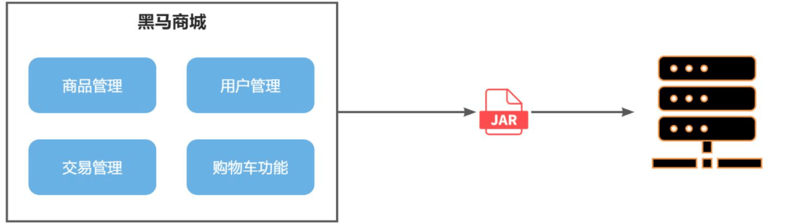

视频跳转：[《黑马商场-微服务开发与实战》](bilibili.com/video/BV1S142197x7?p=1)<br>
资料学习：[《微服务框架》](https://b11et3un53m.feishu.cn/wiki/PsyawI04ei2FQykqfcPcmd7Dnsc)<br>

# 项目介绍
黑马商城是基于当下最流行的微服务架构开发的电商商城系统，旨在给用户一个高效，流畅的购物体验。

# 微服务

## 单体架构
单体架构（monolithic structure）：顾名思义，整个项目中所有功能模块都在一个工程中开发；
项目部署时需要对所有模块一起编译、打包；项目的架构设计、开发模式都非常简单。<br>
<div align=center>

</div>
当项目规模较小时，这种模式上手快，部署、运维也都很方便，因此早期很多小型项目都采用这种模式。<br>
但随着项目的业务规模越来越大，团队开发人员也不断增加，单体架构就呈现出越来越多的问题：<br>

- 团队协作成本高：试想一下，你们团队数十个人同时协作开发同一个项目，由于所有模块都在一个项目中，不同模块的代码之间物理边界越来越模糊。最终要把功能合并到一个分支，你绝对会陷入到解决冲突的泥潭之中。<br>
- 系统发布效率低：任何模块变更都需要发布整个系统，而系统发布过程中需要多个模块之间制约较多，需要对比各种文件，任何一处出现问题都会导致发布失败，往往一次发布需要数十分钟甚至数小时。<br>
- 系统可用性差：单体架构各个功能模块是作为一个服务部署，相互之间会互相影响，一些热点功能会耗尽系统资源，导致其它服务低可用。<br>

而要想解决这些问题，就需要使用微服务架构了。<br>

## 微服务架构
微服务架构，首先是服务化，就是将单体架构中的功能模块从单体应用中拆分出来，独立部署为多个服务。同时要满足下面的一些特点：<br>
- 单一职责：一个微服务负责一部分业务功能，并且其核心数据不依赖于其它模块。<br>
- 团队自治：每个微服务都有自己独立的开发、测试、发布、运维人员，团队人员规模不超过10人（2张披萨能喂饱）<br>
- 服务自治：每个微服务都独立打包部署，访问自己独立的数据库。并且要做好服务隔离，避免对其它服务产生影响<br>
<div align=center>
<br>
</div>

# 项目总体架构

<div align=center>

</div>

# 重点技术总结

## MybatisPlus
MybatisPlus:在日常开发中应该能发现，单表的CRUD功能代码重复度很高，也没有什么难度。
而这部分代码量往往比较大，开发起来比较费时。
因此，目前企业中都会使用一些组件来简化或省略单表的CRUD开发工作。
目前在国内使用较多的一个组件就是MybatisPlus。<br>

<div align=center>

</div>


### 定义Mapper
为了简化单表CRUD，MybatisPlus提供了一个基础的BaseMapper接口，其中已经实现了单表的CRUD:<br>
<div align=center>
<br>
</div>

具体代码示例：
```java
import com.baomidou.mybatisplus.core.mapper.BaseMapper;
import com.itheima.mp.domain.po.User;

public interface UserMapper extends BaseMapper<User> {
}
```
```java
    @Autowired
    private UserMapper userMapper;

    @Test
    void testInsert() {
        User user = new User();
        user.setId(5L);
        user.setUsername("Lucy");
        user.setPassword("123");
        user.setPhone("18688990011");
        user.setBalance(200);
        user.setInfo("{\"age\": 24, \"intro\": \"英文老师\", \"gender\": \"female\"}");
        user.setCreateTime(LocalDateTime.now());
        user.setUpdateTime(LocalDateTime.now());
        userMapper.insert(user);
    }

    @Test
    void testSelectById() {
        User user = userMapper.selectById(5L);
    }

    @Test
    void testSelectByIds() {
        List<User> users = userMapper.selectBatchIds(List.of(1L, 2L, 3L, 4L, 5L));
    }

    @Test
    void testUpdateById() {
        User user = new User();
        user.setId(5L);
        user.setBalance(20000);
        userMapper.updateById(user);
    }

    @Test
    void testDelete() {
        userMapper.deleteById(5L);
    }
```

### 条件构造器
除了新增以外，修改、删除、查询的SQL语句都需要指定where条件。
因此BaseMapper中提供的相关方法除了以id作为where条件以外，还支持更加复杂的where条件。<br>

#### QueryWrapper
查询：查询出名字中带o的，存款大于等于1000元的人。代码如下：
```java
@Test
void testQueryWrapper() {
    // 1.构建查询条件 where name like "%o%" AND balance >= 1000
    QueryWrapper<User> wrapper = new QueryWrapper<User>()
            .select("id", "username", "info", "balance")
            .like("username", "o")
            .ge("balance", 1000);
    // 2.查询数据
    List<User> users = userMapper.selectList(wrapper);
    users.forEach(System.out::println);
}
```
更新：更新用户名为jack的用户的余额为2000，代码如下：
```java
@Test
void testUpdateByQueryWrapper() {
    // 1.构建查询条件 where name = "Jack"
    QueryWrapper<User> wrapper = new QueryWrapper<User>().eq("username", "Jack");
    // 2.更新数据，user中非null字段都会作为set语句
    User user = new User();
    user.setBalance(2000);
    userMapper.update(user, wrapper);
}
```
#### UpdateWrapper
基于BaseMapper中的update方法更新时只能直接赋值，对于一些复杂的需求就难以实现。<br>
例如：更新id为1,2,4的用户的余额，扣200，对应的SQL应该是：
```mysql
UPDATE user SET balance = balance - 200 WHERE id in (1, 2, 4)
```
这个时候就要利用UpdateWrapper中的setSql功能了：
```java
@Test
void testUpdateWrapper() {
    List<Long> ids = List.of(1L, 2L, 4L);
    // 1.生成SQL
    UpdateWrapper<User> wrapper = new UpdateWrapper<User>()
            .setSql("balance = balance - 200") // SET balance = balance - 200
            .in("id", ids); // WHERE id in (1, 2, 4)
        // 2.更新，注意第一个参数可以给null，也就是不填更新字段和数据，
    // 而是基于UpdateWrapper中的setSQL来更新
    userMapper.update(null, wrapper);
}
```

### Service接口
MybatisPlus不仅提供了BaseMapper，还提供了通用的Service接口及默认实现，封装了一些常用的service模板方法。<br>
```java
public interface IUserService extends IService<User> {
    // 拓展自定义方法
}
```
```java
@Service
public class UserServiceImpl extends ServiceImpl<UserMapper, User> implements IUserService {
    
}
```
```java
    private final IUserService userService;

    @PostMapping
    @ApiOperation("新增用户")
    public void saveUser(@RequestBody UserFormDTO userFormDTO){
        // 1.转换DTO为PO
        User user = BeanUtil.copyProperties(userFormDTO, User.class);
        // 2.新增
        userService.save(user);
    }

    @DeleteMapping("/{id}")
    @ApiOperation("删除用户")
    public void removeUserById(@PathVariable("id") Long userId){
        userService.removeById(userId);
    }

    @GetMapping("/{id}")
    @ApiOperation("根据id查询用户")
    public UserVO queryUserById(@PathVariable("id") Long userId){
        // 1.查询用户
        User user = userService.getById(userId);
        // 2.处理vo
        return BeanUtil.copyProperties(user, UserVO.class);
    }

    @GetMapping
    @ApiOperation("根据id集合查询用户")
    public List<UserVO> queryUserByIds(@RequestParam("ids") List<Long> ids){
        // 1.查询用户
        List<User> users = userService.listByIds(ids);
        // 2.处理vo
        return BeanUtil.copyToList(users, UserVO.class);
    }
```

## Docker
微服务项目动辄就是几十台、上百台服务需要部署，有些大型项目甚至达到数万台服务。
而由于每台服务器的运行环境不同，写好的安装流程、部署脚本并不一定在每个服务器都能正常运行，
经常会出错。这就给系统的部署运维带来了很多困难。<br>
那么，有没有一种技术能够避免部署对服务器环境的依赖，减少复杂的部署流程呢？<br>
答案是肯定的，这就是Docker技术。有了Docker以后项目的部署如丝般顺滑，大大减少了运维工作量。
即便对Linux不熟悉，也能轻松部署各种常见软件、Java项目。<br>

### Docker部署

Docker本身包含一个后台服务，我们可以利用Docker命令告诉Docker服务，
帮助我们快速部署指定的应用。Docker服务部署应用时，首先要去搜索并下载应用对应的镜像，
然后根据镜像创建并允许容器，应用就部署完成了。<br>
<div align=center>
<br>
</div>

### Docker常见命令及关系

<div align=center>
<br>
</div>

## SpringCloud
微服务拆分以后碰到的各种问题都有对应的解决方案和微服务组件，
而SpringCloud框架可以说是目前Java领域最全面的微服务组件的集合了。
另外，Alibaba的微服务产品SpringCloudAlibaba目前也成为了SpringCloud组件中的一员。<br>
<div align=center>
<br>
</div>

## RestTemplate
跨服务调用：Spring给我们提供了一个RestTemplate的API，可以方便的实现Http请求的发送。<br>
Java发送http请求可以使用Spring提供的RestTemplate，使用的基本步骤如下：<br>
- 注册RestTemplate到Spring容器
- 调用RestTemplate的API发送请求，常见方法有：
    - getForObject：发送Get请求并返回指定类型对象
    - PostForObject：发送Post请求并返回指定类型对象
    - put：发送PUT请求
    - delete：发送Delete请求
    - exchange：发送任意类型请求，返回ResponseEntity
```java
    ResponseEntity<List<ItemDTO>> response = restTemplate.exchange(
            "http://localhost:8081/items?ids={ids}",
            HttpMethod.GET,
            null,
            new ParameterizedTypeReference<List<ItemDTO>>() {
            },
            Map.of("ids", CollUtil.join(itemIds, ","))
    );
    // 2.2.解析响应
    if(!response.getStatusCode().is2xxSuccessful()){
        // 查询失败，直接结束
        return;
    }
    List<ItemDTO> items = response.getBody();
```

## Nacos注册中心
在大型微服务项目中，服务提供者的数量会非常多，为了管理这些服务就引入了注册中心的概念。注册中心、服务提供者、服务消费者三者间关系如下：<br>
<div align=center>
<br>
</div>

流程如下：
- 服务启动时就会注册自己的服务信息（服务名、IP、端口）到注册中心
- 调用者可以从注册中心订阅想要的服务，获取服务对应的实例列表（1个服务可能多实例部署）
- 调用者自己对实例列表负载均衡，挑选一个实例
- 调用者向该实例发起远程调用

服务调用者必须利用负载均衡的算法，从多个实例中挑选一个去访问。常见的负载均衡算法有：
- 随机
- 轮询
- IP的hash
- 最近最少访问

另外，服务发现需要用到一个工具，DiscoveryClient，SpringCloud已经帮我们自动装配，我们可以直接注入使用。<br>
```java
List<ServiceInstance> instances = discoveryClient.getInstances("item-service");
if (CollUtil.isEmpty(instances)){
    return;
}
ServiceInstance instance = instances.get(RandomUtil.randomInt(instances.size()));

//通过发起网络请求获取itemservice当中的获取商品信息功能
ResponseEntity<List<ItemDTO>> response = restTemplate.exchange(
        instance.getUri()+"/items?ids={ids}",
        HttpMethod.GET,
        null,
        new ParameterizedTypeReference<List<ItemDTO>>() {
        },
        Map.of("ids", CollUtil.join(itemIds, ","))
);
```


## OpenFeign
利用Nacos实现了服务的治理，利用RestTemplate实现了服务的远程调用。但是远程调用的代码太复杂了。
因此，必须想办法改变远程调用的开发模式，让远程调用像本地方法调用一样简单。而这就要用到OpenFeign组件了。
其实远程调用的关键点就在于四个：
- 请求方式
- 请求路径
- 请求参数
- 返回值类型

所以，OpenFeign就利用SpringMVC的相关注解来声明上述4个参数，然后基于动态代理生成远程调用的代码，而无需手动再编写，非常方便。<br>

```java
@FeignClient("item-service")
public interface ItemClient {

    @GetMapping("/items")
    List<ItemDTO> queryItemByIds(@RequestParam("ids") Collection<Long> ids);
}
```
```java
//openfeign技术化简restTemplate和nacos技术
List<ItemDTO> items = itemClient.queryItemByIds(itemIds);
```


## 网关
由于每个微服务都有不同的地址或端口，入口不同，在与前端联调的时候发现了一些问题：<br>
- 请求不同数据时要访问不同的入口，需要维护多个入口地址，麻烦
- 前端无法调用nacos，无法实时更新服务列表

单体架构时只需要完成一次用户登录、身份校验，就可以在所有业务中获取到用户信息。而微服务拆分后，每个微服务都独立部署，这就存在一些问题：
- 每个微服务都需要编写登录校验、用户信息获取的功能吗？
- 当微服务之间调用时，该如何传递用户信息？

不要着急，这些问题都可以通过网关技术解决。<br>
什么是网关？<br>
顾明思议，网关就是网络的关口。数据在网络间传输，
从一个网络传输到另一网络时就需要经过网关来做数据的路由和转发以及数据安全的校验。<br>
现在，微服务网关就起到同样的作用。前端请求不能直接访问微服务，而是要请求网关：<br>
- 网关可以做安全控制，也就是登录身份校验，校验通过才放行
- 通过认证后，网关再根据请求判断应该访问哪个微服务，将请求转发过去

<div align=center>
<br>
</div>

在SpringCloud当中，提供了两种网关实现方案：<br>
- Netflix Zuul：早期实现，目前已经淘汰。<br>
- SpringCloudGateway：基于Spring的WebFlux技术，完全支持响应式编程，吞吐能力更强。<br>

### 配置路由
结合nacos即可进入8080端口访问item相关服务。
```yaml
server:
  port: 8080
spring:
  cloud:
    nacos:
      server-addr: 192.168.***.***:8848
    gateway:
      routes:
        - id: item  # 路由规则id，自定义，唯一
          uri: lb://item-service # 路由的目标服务，lb代表负载均衡，会从注册中心拉取服务列表
          predicates: # 路由断言，判断当前请求是否符合当前规则，符合则路由到目标服务
            - Path=/items/**,/search/** # 这里是以请求路径作为判断规则
```


### 网关登录校验

<div align=center>
<br>
</div>


#### 网关过滤器
如图中所示，最终请求转发是有一个名为NettyRoutingFilter的过滤器来执行的，
而且这个过滤器是整个过滤器链中顺序最靠后的一个。如果能够定义一个过滤器，
在其中实现登录校验逻辑，并且将过滤器执行顺序定义到NettyRoutingFilter之前，这就符合需求了！
<div align=center>
<br>
</div>

```java
public Mono<Void> filter(ServerWebExchange exchange, GatewayFilterChain chain) {
    // 1.获取Request
    ServerHttpRequest request = exchange.getRequest();
    // 2.判断是否不需要拦截
    if(isExclude(request.getPath().toString())){
        // 无需拦截，直接放行
        return chain.filter(exchange);
    }
    // 3.获取请求头中的token
    String token = null;
    List<String> headers = request.getHeaders().get("authorization");
    if (!CollUtils.isEmpty(headers)) {
        token = headers.get(0);
    }
    // 4.校验并解析token
    Long userId = null;
    try {
        userId = jwtTool.parseToken(token);
    } catch (UnauthorizedException e) {
        // 如果无效，拦截
        ServerHttpResponse response = exchange.getResponse();
        response.setRawStatusCode(401);
        return response.setComplete();
    }

    // 如果有效，传递用户信息
    String userInfo = userId.toString();
    ServerWebExchange swe = exchange.mutate()
          .request(builder -> builder.header("user-info", userInfo))
          .build();
    // 6.放行
    return chain.filter(swe);
}
```
每个微服务都配置都配置拦截器，登录校验用户ID。、
```java
public class UserInfoInterceptor implements HandlerInterceptor {
    @Override
    public boolean preHandle(HttpServletRequest request, HttpServletResponse response, Object handler) throws Exception {
        // 1.获取请求头中的用户信息
        String userInfo = request.getHeader("user-info");
        // 2.判断是否为空
        if (StrUtil.isNotBlank(userInfo)) {
            // 不为空，保存到ThreadLocal
                UserContext.setUser(Long.valueOf(userInfo));
        }
        // 3.放行
        return true;
    }

    @Override
    public void afterCompletion(HttpServletRequest request, HttpServletResponse response, Object handler, Exception ex) throws Exception {
        // 移除用户
        UserContext.removeUser();
    }
}
```
在微服务内部，利用OpenFeign调用其他微服务时，同样需要传递用户进行校验。
```java
@Bean
public RequestInterceptor userInfoRequestInterceptor(){
    return new RequestInterceptor() {
        @Override
        public void apply(RequestTemplate template) {
            // 获取登录用户
            Long userId = UserContext.getUser();
            if(userId == null) {
                // 如果为空则直接跳过
                return;
            }
            // 如果不为空则放入请求头中，传递给下游微服务
            template.header("user-info", userId.toString());
        }
    };
}
```

## Sentinel

### 请求限流
在簇点链路后面点击流控按钮，即可对其做限流配置：
<div align=center>
<br>
</div>

在弹出的菜单中这样填写：<br>
<div align=center>
<br>
</div>
这样就把查询购物车列表这个簇点资源的流量限制在了每秒6个，也就是最大QPS为6。<br>

### 线程隔离
查询购物车的时候需要查询商品，为了避免因商品服务出现故障导致购物车服务级联失败，
我们可以把购物车业务中查询商品的部分隔离起来，限制可用的线程资源：<br>
<div align=center>
<br>
</div>

#### OpenFeign整合Sentinel
```yaml
feign:
  sentinel:
    enabled: true # 开启feign对sentinel的支持
```
点击查询商品的FeignClient对应的簇点资源后面的流控按钮：<br>
<div align=center>
<br>
</div>

<div align=center>
<br>
</div>

注意，这里勾选的是并发线程数限制，也就是说这个查询功能最多使用5个线程，而不是5QPS。
如果查询商品的接口每秒处理2个请求，则5个线程的实际QPS在10左右，而超出的请求自然会被拒绝。<br>
<div align=center>
<br>
</div>


## Seata-分布式事务、
在Seata的事务管理中有三个重要的角色：<br>
-  TC (Transaction Coordinator) - 事务协调者：维护全局和分支事务的状态，协调全局事务提交或回滚。
-  TM (Transaction Manager) - 事务管理器：定义全局事务的范围、开始全局事务、提交或回滚全局事务。
-  RM (Resource Manager) - 资源管理器：管理分支事务，与TC交谈以注册分支事务和报告分支事务的状态，并驱动分支事务提交或回滚。

<div align=center>
<br>
</div>

Seata支持四种不同的分布式事务解决方案：
- XA
- TCC
- AT
- SAGA

#### Seata的XA模型
Seata对原始的XA模式做了简单的封装和改造，以适应自己的事务模型，基本架构如图：<br>

<div align=center>
<br>
</div>

RM一阶段的工作：
1. 注册分支事务到TC
2. 执行分支业务sql但不提交
3. 报告执行状态到TC

TC二阶段的工作：
1.  TC检测各分支事务执行状态
1. 如果都成功，通知所有RM提交事务
2. 如果有失败，通知所有RM回滚事务

RM二阶段的工作：
- 接收TC指令，提交或回滚事务

#### Seata的AT模型
AT模式同样是分阶段提交的事务模型，不过缺弥补了XA模型中资源锁定周期过长的缺陷。<br>

<div align=center>
<br>
</div>

阶段一RM的工作：
- 注册分支事务
- 记录undo-log（数据快照）
- 执行业务sql并提交
- 报告事务状态
  阶段二提交时RM的工作：
- 删除undo-log即可
  阶段二回滚时RM的工作：
- 根据undo-log恢复数据到更新前

#### AT与XA的区别

简述AT模式与XA模式最大的区别是什么？
- XA模式一阶段不提交事务，锁定资源；AT模式一阶段直接提交，不锁定资源。
- XA模式依赖数据库机制实现回滚；AT模式利用数据快照实现数据回滚。
- XA模式强一致；AT模式最终一致

可见，AT模式使用起来更加简单，无业务侵入，性能更好。因此企业90%的分布式事务都可以用AT模式来解决。<br>


## RabbitMQ--异步调用
RabbitMQ对应的架构如图：<br>

<div align=center>
<br>
</div>

其中包含几个概念：
- publisher：生产者，也就是发送消息的一方
- consumer：消费者，也就是消费消息的一方
- queue：队列，存储消息。生产者投递的消息会暂存在消息队列中，等待消费者处理
- exchange：交换机，负责消息路由。生产者发送的消息由交换机决定投递到哪个队列。
- virtual host：虚拟主机，起到数据隔离的作用。每个虚拟主机相互独立，有各自的exchange、queue

### SpringAMQP
由于RabbitMQ采用了AMQP协议，因此它具备跨语言的特性。
任何语言只要遵循AMQP协议收发消息，都可以与RabbitMQ交互。
并且RabbitMQ官方也提供了各种不同语言的客户端。
但是，RabbitMQ官方提供的Java客户端编码相对复杂，
一般生产环境下我们更多会结合Spring来使用。
而Spring的官方刚好基于RabbitMQ提供了这样一套消息收发的模板工具：
SpringAMQP。并且还基于SpringBoot对其实现了自动装配，使用起来非常方便。<br>
消息发送：<br>
```java
@SpringBootTest
public class SpringAmqpTest {

    @Autowired
    private RabbitTemplate rabbitTemplate;

    @Test
    public void testSimpleQueue() {
        // 队列名称
        String queueName = "simple.queue";
        // 消息
        String message = "hello, spring amqp!";
        // 发送消息
        rabbitTemplate.convertAndSend(queueName, message);
    }
}
```
消息接受：<br>
```java
@Component
public class SpringRabbitListener {
  // 利用RabbitListener来声明要监听的队列信息
  // 将来一旦监听的队列中有了消息，就会推送给当前服务，调用当前方法，处理消息。
  // 可以看到方法体中接收的就是消息体的内容
  @RabbitListener(queues = "simple.queue")
  public void listenSimpleQueueMessage(String msg) throws InterruptedException {
    System.out.println("spring 消费者接收到消息：【" + msg + "】");
  }
}
```


## Elasticsearch
elasticsearch是一款非常强大的开源搜索引擎，支持的功能非常多。

### 倒排索引
倒排索引中有两个非常重要的概念：
- 文档（Document）：用来搜索的数据，其中的每一条数据就是一个文档。例如一个网页、一个商品信息
- 词条（Term）：对文档数据或用户搜索数据，利用某种算法分词，得到的具备含义的词语就是词条。例如：我是中国人，就可以分为：我、是、中国人、中国、国人这样的几个词条

创建倒排索引是对正向索引的一种特殊处理和应用，流程如下：
- 将每一个文档的数据利用分词算法根据语义拆分，得到一个个词条
- 创建表，每行数据包括词条、词条所在文档id、位置等信息
- 因为词条唯一性，可以给词条创建正向索引

倒排索引的搜索流程如下（以搜索"华为手机"为例），如图：<br>

<div align=center>
<br>
</div>

流程描述：<br>
1）用户输入条件"华为手机"进行搜索。<br>
2）对用户输入条件分词，得到词条：华为、手机。<br>
3）拿着词条在倒排索引中查找（由于词条有索引，查询效率很高），即可得到包含词条的文档id：1、2、3。<br>
4）拿着文档id到正向索引中查找具体文档即可（由于id也有索引，查询效率也很高）。<br>